# OpenF1 Driver Comparison Dashboard

Dashboard Dash per comparare la telemetria di due piloti su giri diversi usando l'API OpenF1.

> Nota: durante le sessioni attive (FP, Qualifiche, Gara) l'API OpenF1 nasconde i dati live: servirebbe un abbonamento per vederli in tempo reale. I dati tornano disponibili a sessione conclusa.

## Cosa fa
- Flusso: Anno > Circuito > Sessione > Pilota/Giro 1 e 2 > Grafici.
- Due tab: **Telemetria giro** (7 grafici sincronizzati) e **Confronto tutti i giri** (tempi e delta giro-giro tra due piloti).
- Telemetria: Tracciato GPS, Delta tempo, Velocita, Heatmap Velocita, Throttle, Brake, Marcia; click sui grafici di telemetria aggiunge linea verticale e marker sul tracciato (hh:mm:ss.sss).
- Confronto giri: heatmap tempi con tempi migliori per lap in grassetto, colonna delta e colonna delta cumulativo (entrambe non colorate) più grafici linea/bar per tempi e delta.
- Multilingua: selettore Italiano/English in alto, testi e messaggi tradotti (default Italiano).
- Ordine grafici personalizzabile (radio + pulsanti su/giu/reset) con rendering dinamico.
- Cache locale delle risposte API; pulsante per svuotare la cache con stato mostrato.
- Spinner di caricamento sui grafici durante gli update e pulsante "Stampa PDF".

## Dipendenze
```bash
pip install -r requirements.txt
# oppure
pip install requests pandas dash plotly numpy
```

## Avvio rapido (Windows)
```powershell
cd "c:\F1 OPEN API"
python main.py
# poi apri http://127.0.0.1:8050
```
- Demo live: https://f1-open-api-dashboard.onrender.com/

## Lingue
- Selettore in alto a destra: Italiano (default) o English.
- Tradotti titoli, etichette, pulsanti e messaggi di stato/grafici principali.

## Struttura
```
main.py                 # Entry point Dash
config.py               # Costanti (colori, base URL, timeout)
api/openf1.py           # Wrapper API OpenF1
components/layout.py    # Layout HTML e componenti (store, controlli, grafici)
callbacks/meetings.py   # Caricamento circuiti e sessioni
callbacks/drivers.py    # Caricamento piloti e giri; sync dropdown
callbacks/graphs.py     # Grafici di telemetria + selezione tempo via click
callbacks/cache.py      # Stato e reset cache
callbacks/graph_order.py# Gestione ordine grafici e rendering dinamico
callbacks/all_laps.py   # Grafici di confronto su tutti i giri della sessione
utils/telemetry.py      # Calcolo delta, durata, formattazione
utils/cache.py          # Cache file-based JSON
utils/graph_order.py    # Ordine grafici e titoli
```

## Come usarla
1) Inserisci l'anno e clicca "Carica Circuiti".  
2) Scegli circuito e sessione.  
3) Seleziona Pilota 1 e 2 e i rispettivi giri.  
4) Tab Telemetria: click su speed/throttle/brake/gear per fissare un tempo, si aggiorna la linea verticale, compaiono i marker sul tracciato e gli altri grafici si allineano (tempo hh:mm:ss.sss).  
5) Tab Confronto tutti i giri: vedi andamento dei tempi giro e delta tra i due piloti su tutti i lap disponibili.  
6) Cambia l'ordine dei grafici con radio e pulsanti su/giu/reset; la pagina si aggiorna istantaneamente.  
7) Pulisci la cache con il pulsante dedicato se vuoi ricaricare dati freschi.  

## Grafici (titolo legenda)
- Tracciato GPS - P1 vs P2  
- Delta tempo - P2 vs P1  
- Velocita  
- Heatmap Velocita  
- Throttle  
- Brake  
- Marcia  

## Note tecniche
- Dati normalizzati con tempo relativo da inizio giro (`t_rel_s`).
- Delta tempo interpolato a 200 punti per giri di durata diversa.
- Se `date_end` manca viene stimata (fallback 2 minuti) per calcolare la durata giro.
- I `dcc.Store` mantengono state e cache locale; `utils/cache.py` gestisce pulizia e dimensione.
- Spinner via `dcc.Loading` su container e singoli grafici.

## Screenshots / GIF
- Flusso ricerca anno/circuito/sessione:  
  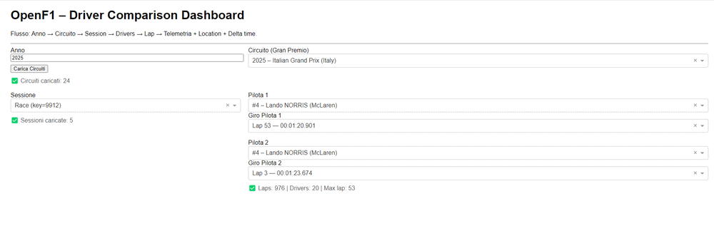
- Riordino grafici:  
  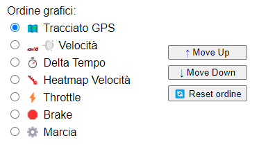
- Tracciato GPS:  
  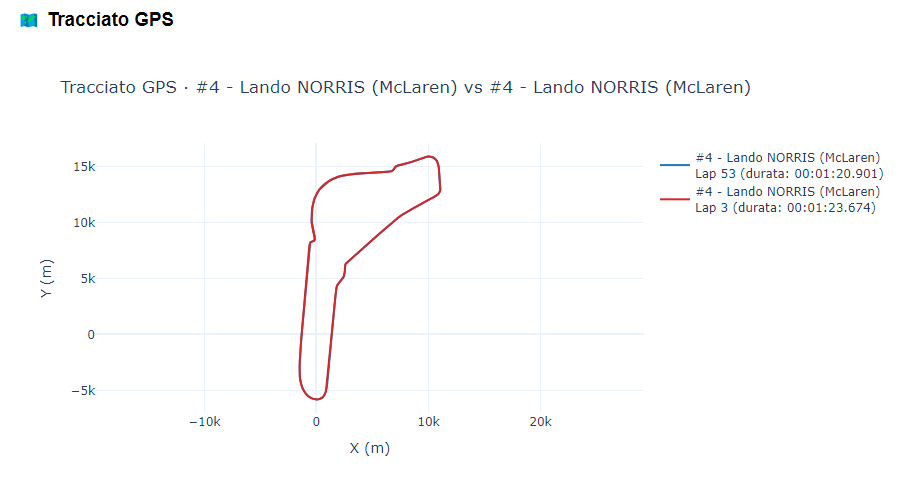
- Delta tempo:  
  
- Velocita:  
  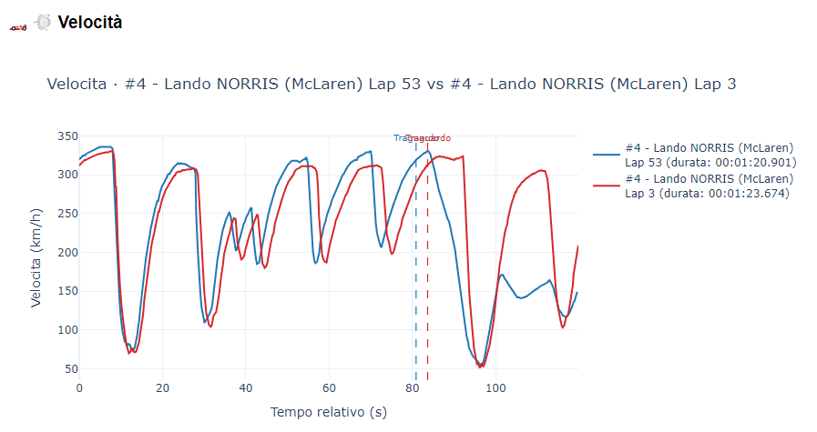
- Heatmap velocita:  
  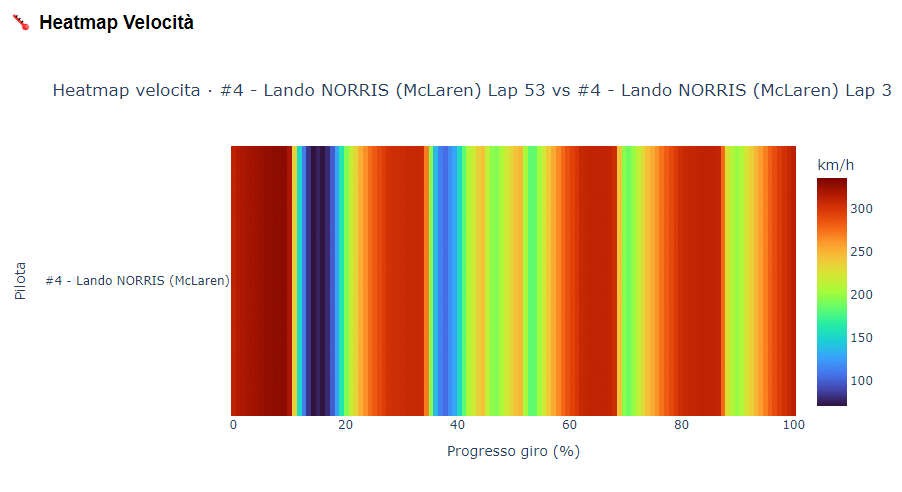
- Throttle:  
  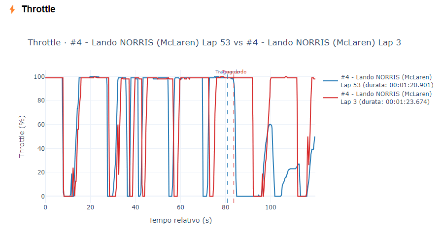
- Brake:  
  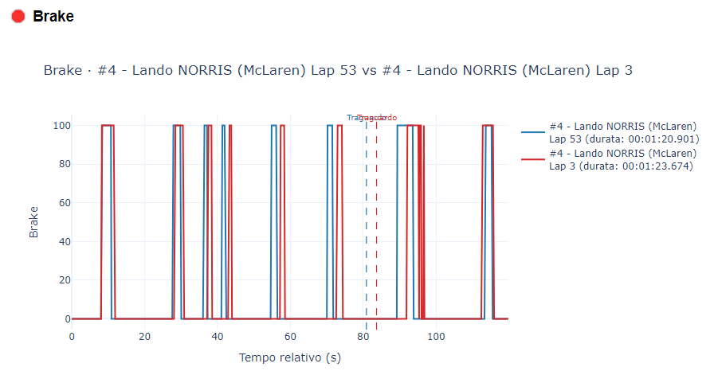
- Marcia:  
  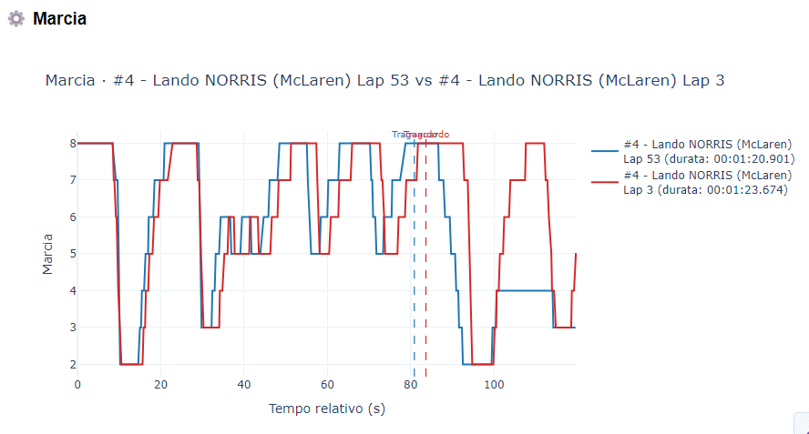
- Confronto tutti i giri (tempi/delta):  
  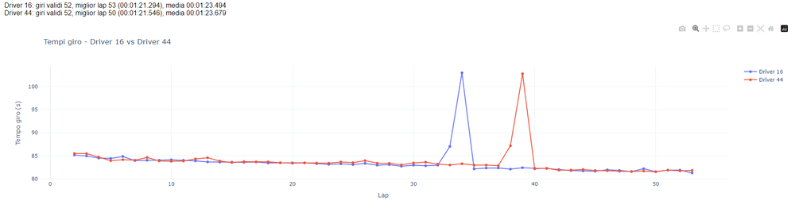  
  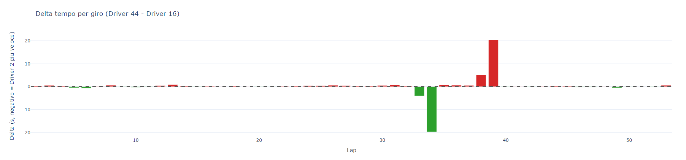
- Confronto giri con delta cumulativo:  
  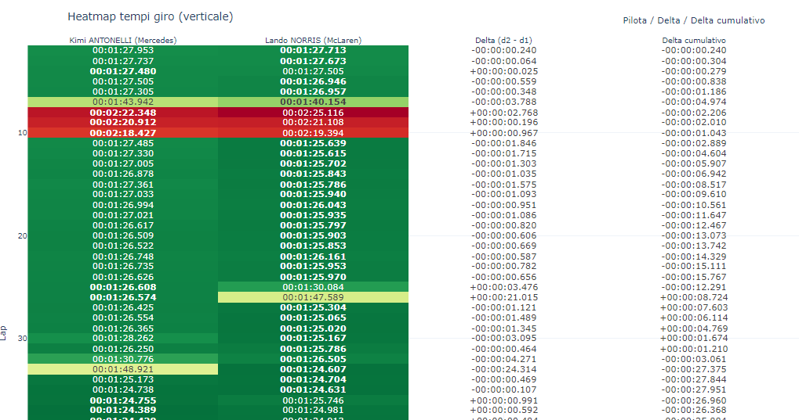

## Troubleshooting
- Nessun car_data trovato: l'API non ha telemetria per quella sessione/giro; prova un'altra sessione.
- Dropdown vuoti/lenti: attendi qualche secondo; controlla la connessione.
- Marker non appare: il click/hover deve avvenire su speed/throttle/brake/gear, non sul tracciato.
- Errore “nonexistent object” speed-graph: usa la versione con seed grafici nel layout.

---
Autore: Leonardo Furio  
Ultimo aggiornamento: 03 dicembre 2025  
Versione: 1.5 (multilingua IT/EN + heatmap delta cumulativo)

---

## English (short version)
- Dash app to compare two drivers using OpenF1; flow: Year > Circuit > Session > Driver/Lap 1&2 > Telemetry + All-lap comparison.
- Tabs: Lap telemetry (7 synced charts) and All-laps (times, delta, heatmap with delta & cumulative delta).
- Language toggle (top right): Italian / English, default Italian.
- Quick start: `python main.py` then open `http://127.0.0.1:8050`.
- New screenshot: `images/lapsconfrontodelta.png` shows the all-laps heatmap with delta and cumulative delta.
